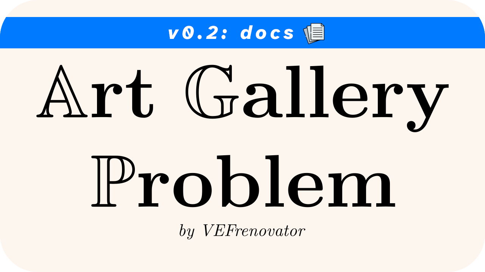
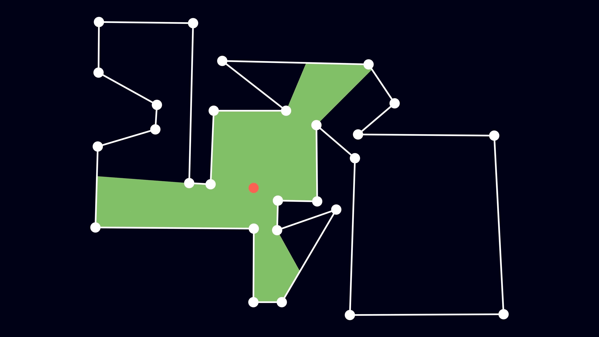
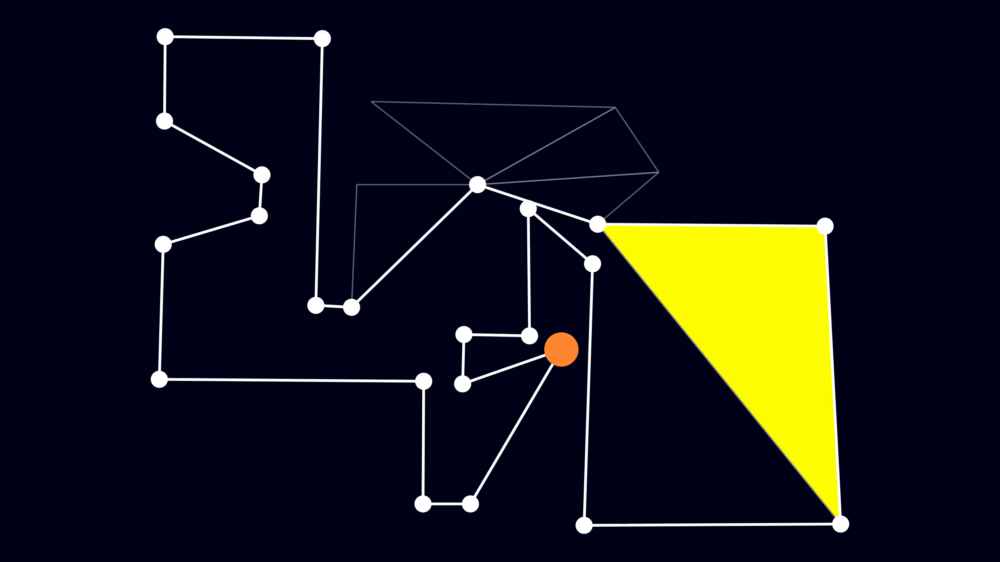
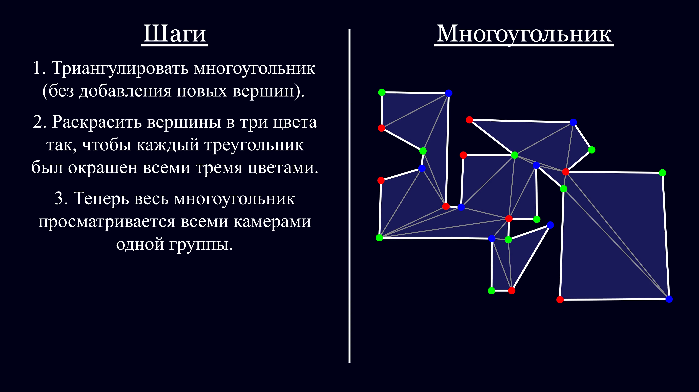
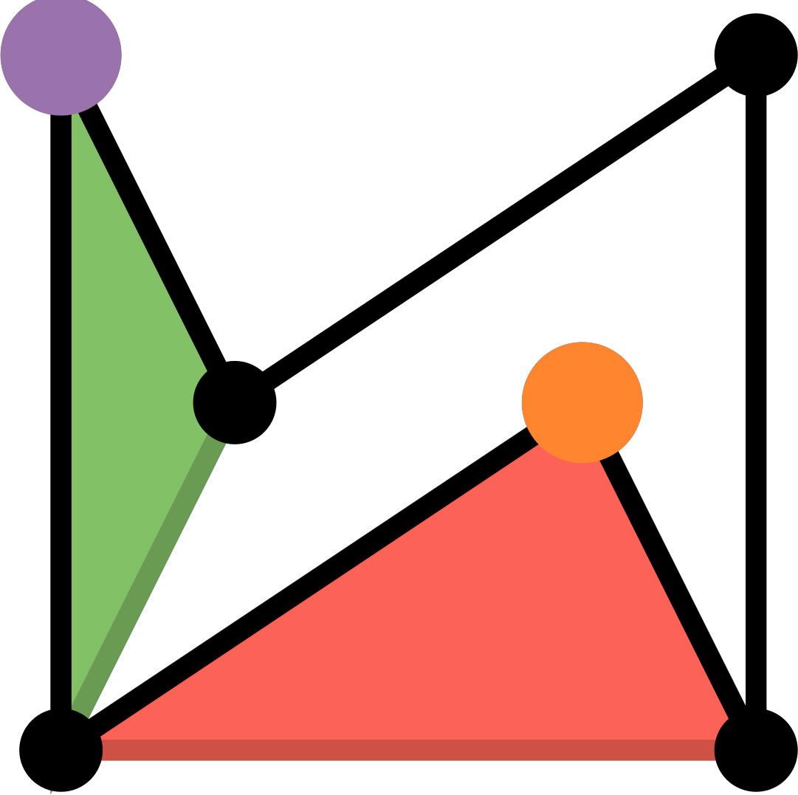
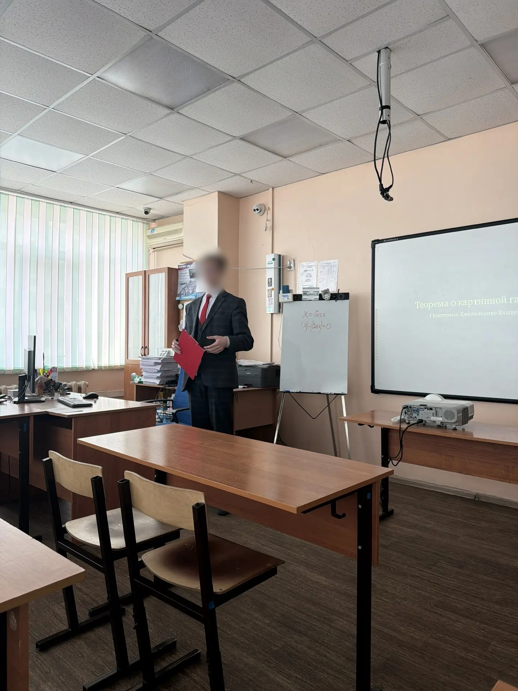
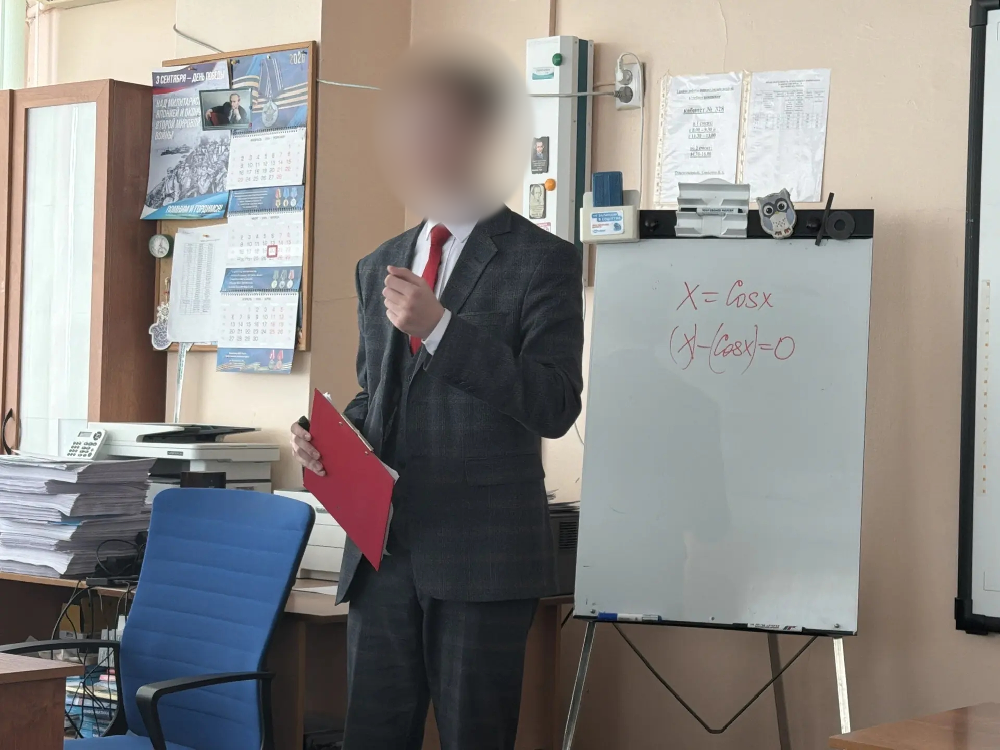

<!-- TODO: Add link to the Full User  -->

<p align="center">
  
  <br /><br />
  <i>A project featuring a <a href="./media/videos/slides_animation/2160p60">ManimCE animation</a>, an accompanying <a href="./slides/conv/full_touchscreen.html">presentation</a>, and a <a href="./documents/SiS_EXP_%D0%97%D0%B0%D0%B4%D0%B0%D1%87%D0%B0%20%D0%BE%20%D0%BA%D0%B0%D1%80%D1%82%D0%B8%D0%BD%D0%BD%D0%BE%D0%B9%20%D0%B3%D0%B5%D0%BB%D0%B5%D1%80%D0%B5%D0%B5%20%D0%A2%D1%80%D0%B8%D0%B0%D0%BD%D0%B3%D1%83%D0%BB%D1%8F%D1%86%D0%B8%D1%8F.pdf">report</a> explaining <b><a href="https://en.wikipedia.org/wiki/Art_gallery_problem#Fisk's_short_proof">Fisk's solution</a></b> to the <b><a href="https://en.wikipedia.org/wiki/Art_gallery_problem">Art Gallery Problem</a></b>.</i>
  <br />
  <i>by VEFrenovator</i>
  <br /><br />
  <b>From the Author:</b> I am newly engaging with the GitHub community, and I welcome any response. Suggestions, tips, or advice of any kind are greatly appreciated. Please feel free to write anything you consider necessary for me. You can use the <a href="https://github.com/VEFrenovator/Art-Gallery-Problem--manim/discussions">Discussions page</a> or contact me directly via <a href="mailto:vladimir_e11@outlook.com">email</a>.
</p>

---

# What Is This Project About?

Hello! 👋

This repository was created as part of my individual final project, focusing on a conceptual visibility problem in computational geometry known as the [Art Gallery Problem](https://en.wikipedia.org/wiki/Art_gallery_problem). Inspired by the [3blue1brown](https://www.youtube.com/c/3blue1brown) YouTube channel, I developed an animation covering the key aspects of the problem statement, [Fisk's solution](https://en.wikipedia.org/wiki/Art_gallery_problem#Fisk's_short_proof), and its real-world applications.

> [!IMPORTANT]
> 
> **Note on Language Support**
> 
> The primary language of the project is Russian. This is not necessarily a problem, as the animation does not contain a lot of textual content; however, translating those texts is necessary if you plan to use the media in an English speech or presentation. Furthermore, most comments within the code are also in Russian.
> 
> **I highly welcome pull requests with English versions, and I encourage submitting issues.** Please contact me so I can dedicate time to making changes and rerendering the animations into English. Currently, only this README has been translated.

# Media Gallery: A Visual Overview

Here you can find selected scenes from the animation, charts from the report, and excerpts from the presentation itself.

<table width="100%" border="0" cellpadding="5">
  <tr class="media-row">
    <td style="text-align: center;">
      <!-- Thumbnail for Problem Description -->
      <br>
      <a href="./media/videos/slides_animation/2160p60/ProblemDescription.mp4">Watch Video "Problem Description" (Download raw may be required)</a>
    </td>
    <td style="text-align: center;">
      <!-- Thumbnail for Triangulation -->
      <br>
      <a href="./media/videos/slides_animation/2160p60/Triangulation.mp4">Watch Video "Triangulation" (Download raw may be required)</a>
    </td>
  </tr>
</table>

<details>
  <summary>Expand to see more from the Gallery! (ps. x = cos x and x - (cos x) = 0 just kind of got into the frame).</summary>

  <table width="100%" border="0" cellpadding="5">
    <!-- First Row of Details -->
    <tr class="media-row">
      <td style="text-align: center;">
        <!-- Thumbnail for Algorithm -->
        <br>
        <a href="./media/videos/slides_animation/2160p60/Algorithm.mp4">Watch Video "Algorithm" (Download raw may be required)</a>
      </td>
      <td style="text-align: center;">
        <!-- Thumbnail for Greetings -->
        <br>
        <a href="./media/videos/slides_animation/2160p60/Greetings.mp4">Watch Video "Greetings" (Download raw may be required)</a>
      </td>
    </tr>
    <!-- Second Row of Details -->
    <tr class="media-row">
      <td style="text-align: center;">
        <!-- Thumbnail for Tricoloring -->
        <br>
        <a href="./media/videos/slides_animation/2160p60/ProblemDescription.mp4">Watch Video "Problem Description" (Download raw may be required)</a>
      </td>
      <td style="text-align: center;">
        <!-- Thumbnail for Examples -->
        <br>
        <a href="./media/videos/slides_animation/2160p60/Examples.mp4">Watch Video "Examples" (Download raw may be required)</a>
      </td>
    </tr>
    <!-- Third Row of Details -->
    <tr class="media-row">
      <td style="text-align: center;"></td>
      <td style="text-align: center;"></td>
    </tr>
    <!-- Fourth Row of Details -->
    <tr class="media-row">
      <td style="text-align: center;"></td>
      <td style="text-align: center;"></td>
    </tr>
  </table>
</details>

---

# Installation

> [!TIP]
> **Pre-Check:** Before installing anything, please determine if you genuinely need to install packages. It is possible to view the animations and presentation without any installation. See more details in the [Quick User Guide or FAQ](#quick-user-guide-or-faq) section.

## Standard Installation

To simplify development, this project utilizes a Python package called **`agp-manim`** (shortened from the repository name). Note that this package is not currently available on GitHub Releases or PyPi. The easiest setup method is:

1. Clone the repository
2. Install the package using a `./pyproject.toml` script via pip.

Execute the following commands:

```bash
git clone --recurse-submodules https://github.com/VEFrenovator/Art-Gallery-Problem--manim
cd Art-Gallery-Problem--manim
pip install -e .
```

After executing these steps, the `agp-manim` Python library will be available in your current environment, allowing you to use it via:

```python
import agp_manim    # Use underscore for best practice
```

> [!NOTE]
> **Editable Package (`-e` flag)**
> 
> If you are certain that you do not intend to make changes to the source code, you can omit the `-e` flag ("editable package"). However, including it is recommended as it guarantees functionality.

> [!IMPORTANT]
> **Limited Functionality**
> 
> The `agp-manim` library itself does not provide all necessary dependencies and has limited inherent functionality. The installation process above only provides the "Base package," which is detailed in the [Custom Installation](#custom-install) section below.

## Custom Installation

The following table details the capabilities of different installation profiles. The options are sorted by increasing number of installed packages and complexity. You can choose the one that fits your needs.

Name | Command(s) | Packages Installed | Abilities
:--: | :--------: | :----------------: | :-------:
Repo | `git clone --recurse-submodules https://github.com/VEFrenovator/Art-Gallery-Problem--manim` | — (repo files only) | To open files locally, including 4k `.mp4` rendered media; Run `.html` presentation using your browser.
Base package | <u><i>All commands from [Standard Installation](#standard-installation) above</i></u> | <u><i>Everything from Repo</i></u> + `agp-manim`, `setuptools`, `requests`, `importlib-metadata` | <u><i>Everything from Repo</i></u> + To import the `agp-manim` library and its submodules, classes, and functions in your Python code.
`manim-slides-present` package | <u><i>All commands from Base</i></u> + `pip install -e .[manim-slides-present]` | <u><i>Everything from Base</i></u> + `manim-slides[full]`, `PyQt6`, `PySide6` | <u><i>Everything from Base</i></u> + To run the presentation using `.json` manim-slides files.
`dev` package | <u><i>All commands from Base</i></u> + `pip install -e .[dev]` | <u><i>Everything from <code>manim-slides-present</code></i></u> + `numpy`, `shapely`, `mapbox-earcut`, `pillow`, `manim` | <u><i>Everything from `manim-slides-present`</i></u> + To run and render any `.py` file in the repository, facilitating development (e.g., adding features or fixing bugs).
`full` package **(alias for `dev`)** | <u><i>All commands from Base</i></u> + `pip install -e .[full]` | <u><i>Everything from `dev`</i></u> | <u><i>Everything from `dev`</i></u>


# Quick User Guide or FAQ

This section is a **shortened** version of the full user guide. For better compression, subsection titles are structured like questions, and the answers follow immediately after.

<details>
  <summary>I want to see the animation and/or presentation without installing anything. Can I do so?</summary>

  **Yes, almost.**

  You can download the rendered 4k animation scenes from [`./media/videos/slides_animation/2160p60`](./media/videos/slides_animation/2160p60) and the presentation materials from [`./slides/conv`](./slides/conv). While there are many `.html` presentation files, the main file is [`full_touchscreen.html`](./slides/conv/full_touchscreen.html). For details on other assets, please see [link to full guide].

</details>

<!-- <details>
  <summary>What are the </summary>
</details> -->

# How to Contribute

This project welcomes contributions! For guidelines, ideas, and more information, please see [CONTRIBUTING.md](./CONTRIBUTING.md).

# License

Licensed under MIT. Copyright © 2025 VEFrenovator. For the license text, please see [LICENSE.md](./LICENSE.md).